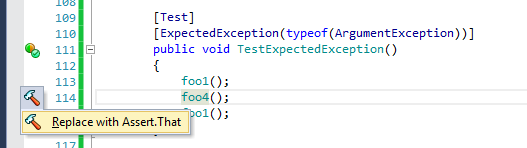
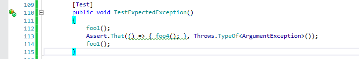
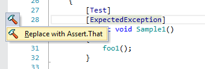
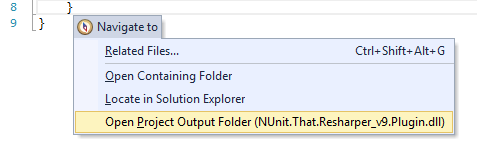
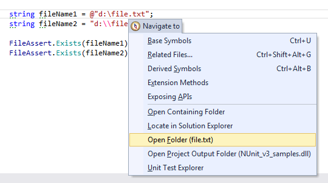
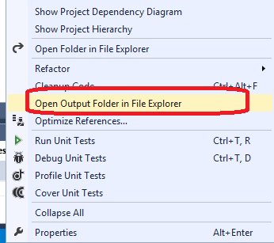
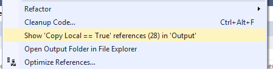
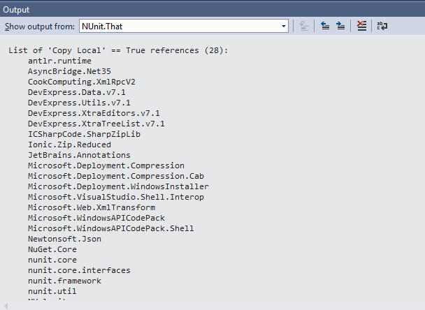
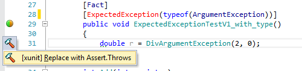

# NUnit.That.Resharper.Plugin
[Resharper](https://www.jetbrains.com/resharper/) plugin for transfer to Assert.That (include NUnit v3 support).

NUnit.That.Resharper.Plugin helps to convert Assert methods and nunit attributes to Assert.That method.
Added support for transfer ExpectedException attribute for **xunit** too.

- NUnit.That.Resharper.Plugin in [Resharper gallery v10](https://resharper-plugins.jetbrains.com/packages/NUnit.That.Resharper_v10.Plugin/)
- NUnit.That.Resharper.Plugin in [Resharper gallery v9](https://resharper-plugins.jetbrains.com/packages/NUnit.That.Resharper_v9.Plugin/)
- NUnit.That.Resharper.Plugin in [Resharper gallery v8](https://resharper-plugins.jetbrains.com/packages/NUnit.That.Resharper_v8.Plugin/)

[Google Trends: NUnit, xunit, MSTest](https://www.google.com/trends/explore#q=NUnit%2C%20xunit%2C%20MSTest&cmpt=q&tz=Etc%2FGMT-2)

### Intro
Attribute "ExpectedException" (when a statemtnt selected) 



can be converted to relevant Assert.That



or the attribute can be converted to Assert.That for last statement in method's body.



[Other way to support **ExpectedException** attribute in NUnit v3 (provided by NUnit Team)] (https://github.com/nunit/nunit-csharp-samples/tree/master/ExpectedExceptionExample)

Advanced "Navigate To.." commands:




Project menu commands:






XUnit sample:



### Short List:

###### Attributes
- Attribute **ExpectedException** to **Assert.That(code, Throws.TypeOf<Exception>())** construction
- Attribute **Ignore** without parameter to **Ignore("")**

###### Assert methods
- Assert.**IsNotNull**(expression) to Assert.**That**(expression, Is.Not.Null)
- Assert.**IsNullOrEmpty**(expression) to Assert.**That**(expression, Is.Null.Or.Empty)
- Assert.**IsNotNullOrEmpty**(expression) to Assert.**That**(expression, Is.Not.Null.Or.Empty)

###### "Navigate To..." Commands
- **Open Containing Folder** Open Windows Explorer on selected source file
- **Open Project Output Folder (output file)** Open Windows Explorer on project output file
- **Open Folder (file)** Open Windows Explorer with selected file

###### Project menu Commands
- **Open Output Folder in File Explorer** Open Windows Explorer on project output file
- **Project: Show 'Copy Local == True' references in 'Output'** Show list of project's references with Copy Local == True
- **Project: Set 'Copy Local == False' references in 'Output'** Set 'Copy Local' to False for all references

###### Solution menu Commands
- **Solution: Show projects structure in 'Output'** Show list of all projects' references with version and location. Shows lists of multi-version and multi-location references.
- **Solution: Show 'Copy Local == True' references in 'Output'** Show list of all projects' references with Copy Local == True

### Samples:

###### Attribute ExpectedException

Attribute ExpectedException
```c#
        [Test, ExpectedException]
        public void TestAndShortExpectedException()
        {
            foo1();
            foo2();
            foo1();
        }
```
to Assert.That(..., Throws.Exception)
```c#
        [Test]
        public void TestAndShortExpectedException()
        {
            foo1();
            Assert.That(() => { foo2(); }, Throws.Exception);
            foo1();
        }
```
Atribute ExpectedException with concrete exception type
```c#
        [Test]
        [ExpectedException(typeof(ArgumentException))]
        public void TestExpectedException()
        {
            foo1();
            foo4();
            foo1();
        }
```
to Assert.That(..., Throws.TypeOf())
```c#
        [Test]
        public void TestExpectedException()
        {
            foo1();
            Assert.That(() => { foo4(); }, Throws.TypeOf<ArgumentException>());
            foo1();
        }
```
Atribute ExpectedException with concrete exception type and expected message
```c#
        [Test]
        [ExpectedException(typeof(NotImplementedException), ExpectedMessage = "customer message")]
        public void TestExpectedExceptionWithCustomerMessage()
        {
            foo4("customer message");
        }
```
to Assert.That(..., Throws.TypeOf().And.Message.EqualTo(expected message));
```c#
        [Test]
        public void TestExpectedExceptionWithCustomerMessage()
        {
            Assert.That(() => { foo4("customer message"); }, Throws.TypeOf<NotImplementedException>().And.Message.EqualTo("customer message"));
        }
```

###### Assert.Is... methods

| Assert.Is...  | Assert.That |
| ------------- | ------------- |
| ```Assert.IsNotNull(actual);``` | ```Assert.That(actual, Is.Not.Null);``` |
| ```Assert.IsNullOrEmpty(actual);``` | ```Assert.That(actual, Is.Null.Or.Empty);``` |
| ```Assert.IsNotNullOrEmpty(actual);```  | ```Assert.That(actual, Is.Not.Null.Or.Empty);``` |
